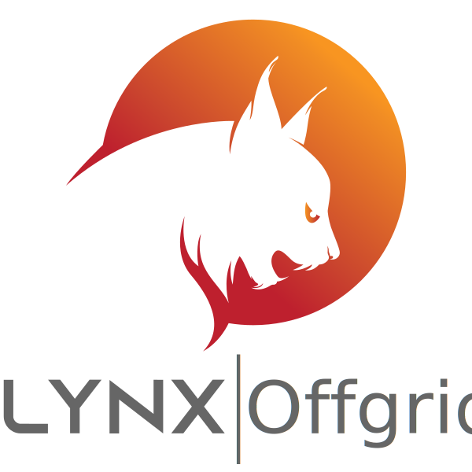

  

# Lynx
Lynx|Offgrid is a simple webmap (built with OpenLayers, Vite and TailwindCSS), with geospatial vector data CRUD and offline capabilities. By default, Lynx uses IndexedDB, but you can change the CRUD-APIs to your preferred backends.
